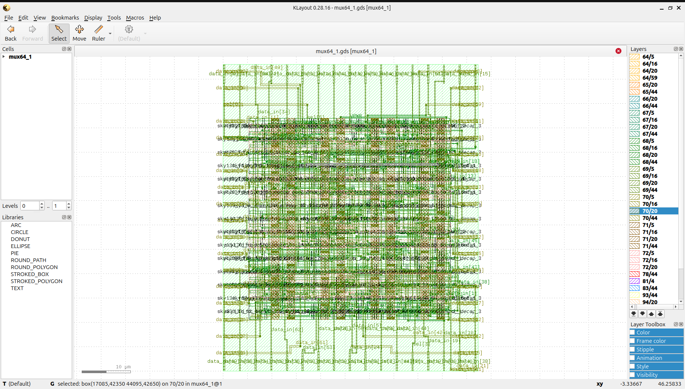
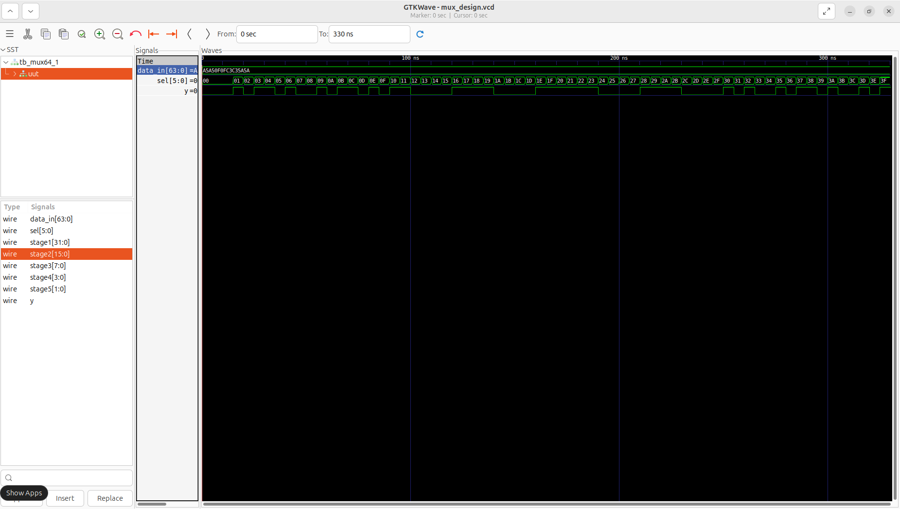
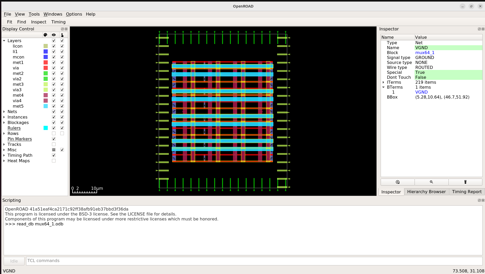
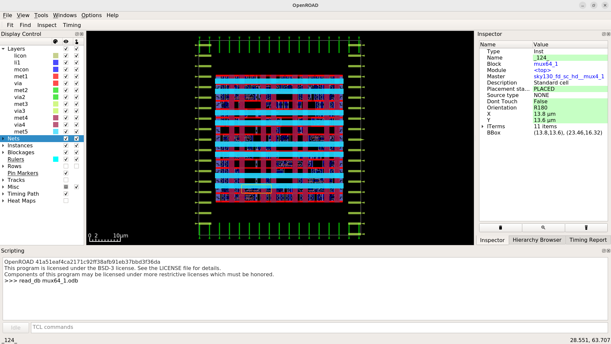
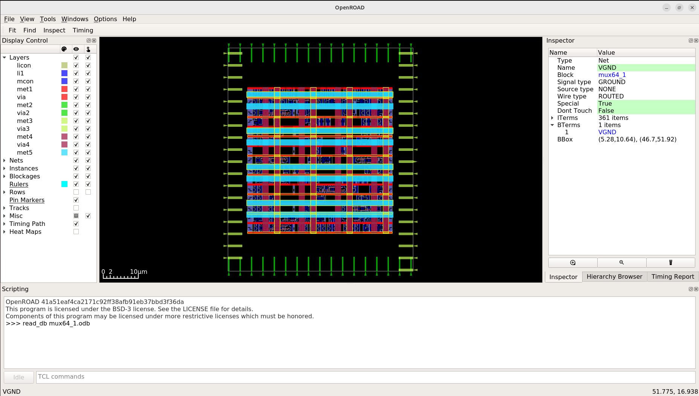
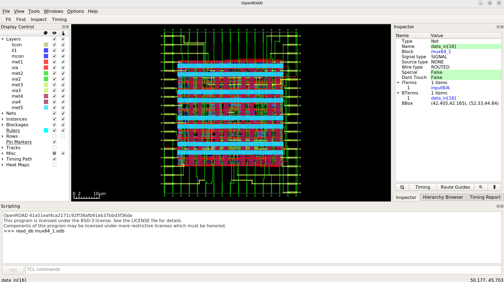
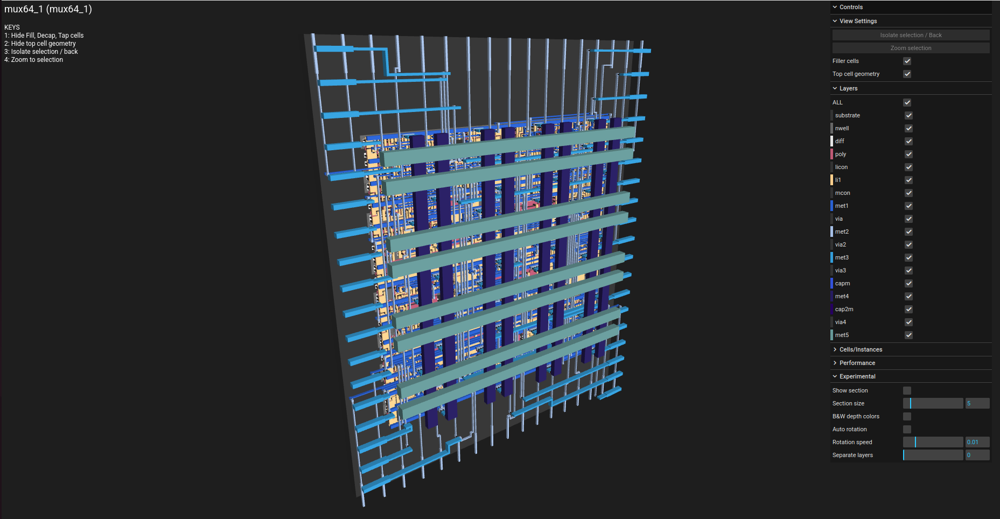
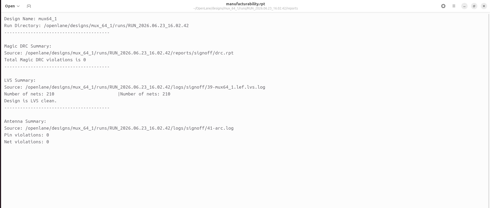

<div align="center">

# 64-to-1 Multiplexer (mux64_1) - Complete RTL-to-GDSII ASIC Flow 🚀
### A Silicon Journey: From Tree-Structured Verilog to Sky130 Manufacturing-Ready Layout

[](https://github.com/The-OpenROAD-Project/OpenLane)
[](https://github.com/google/skywater-pdk)
[](#)
[](#)

*Documenting the complete physical design realization of a high-input 64-to-1 Multiplexer macro using the open-source OpenLane toolchain and SkyWater 130nm standard cell library.*



---

**[Explore the Visual Journey](#-the-rtl-to-gdsii-visual-journey) • [Power & Signoff Metrics](#-power--signoff-metrics) • [Reproduce the Flow](#-how-to-reproduce) • [Repository Structure](#-repository-structure)**

</div>

---

## 💡 Project Overview & Microarchitecture

A **64-to-1 Multiplexer (mux64_1)** is a fundamental combinational routing circuit designed to forward one of 64 distinct data input lines (`data_in[63:0]`) to a single output line (`y`) based on a 6-bit control select bus (`sel[5:0]`). 

To avoid large propagation delays and massive gate fan-in bottlenecks typical of flat multiplexer structures, this design implements a highly optimized **hierarchical tree topology** spanning multiple cascading stages:
* **Stage 1:** 32 intermediate outputs
* **Stage 2:** 16 intermediate outputs
* **Stage 3:** 8 intermediate outputs
* **Stage 4:** 4 intermediate outputs
* **Stage 5:** 2 intermediate outputs
* **Final Stage:** Single scalar output matching the designated selection choice.

This structural approach maps cleanly onto the high-density standard cell architecture of the SkyWater 130nm process node.

---

## 🛠️ Tools & Technology Stack

| Flow Stage | Open-Source Tool / PDK | Function |
| :--- | :--- | :--- |
| **Process Node** | SkyWater 130nm (`sky130A`) | Target silicon manufacturing technology |
| **Functional Verification** | Icarus Verilog (`iverilog`) & GTKWave | RTL simulation and hierarchical waveform inspection |
| **Logic Synthesis** | Yosys & abc | Gate-level netlist generation & tech-mapping |
| **Floorplan & Placement** | OpenROAD | Core/die dimension configuration, PDN, and cell localization |
| **Clock Tree / Timing** | OpenROAD / OpenSTA | Buffer tree insertion, layout skew tuning, and static timing signoff |
| **Routing** | OpenROAD (TritonRoute) | Global and detailed multi-layer metal interconnect layout |
| **Physical Signoff** | Magic, Netgen & KLayout | Manufacturing DRC, LVS netlist matching, and GDSII stream extraction |

---

## 📖 The RTL-to-GDSII Visual Journey

Follow the automated physical design pipeline execution step-by-step with verified visual checkpoints from our runtime workspace:

### 1️⃣ RTL Design & Functional Tree Verification
The behavior of the hierarchical cascading selection logic was checked against structured stimulus vectors. The simulation waveform confirms clean output switching across the data select transitions, showing the multi-stage reduction tree variables executing synchronously.

<p align="center">
  
</p>

### 2️⃣ Logic Synthesis & Timing Analysis
The behavioral netlist is mapped down onto the physical gates using Yosys. Initial optimization paths run right after mapping to balance area metrics against cell driving logic requirements.


### 3️⃣ Floorplanning & Power Delivery Network (PDN)
The core boundary and aspect ratio are established to comfortably house the complex routing matrix for the 64 data inputs. The PDN grid lays down robust, alternate vertical and horizontal stripes for power supply distribution (`VPWR`/`VGND`) to protect against IR-drop degradation.

<p align="center">
  
  
</p>

### 4️⃣ Global & Detailed Cell Placement
The structural multiplexer gate components are mapped and legally bound within standard cell rows. The placement optimization distributes the input pin loads uniformly across the design arena to eliminate routing congestion around the select distribution nets.

<p align="center">
  
  
</p>

### 5️⃣ Clock Tree Synthesis (CTS) & Buffer Optimization
Timing networks, select bus routing chains, and distribution driver blocks are structured during this phase. This step optimizes drive strengths to ensure minimum skew and uniform transition steps across all deep routing logic levels.

<p align="center">
  
</p>

### 6️⃣ Interconnect Detailed Routing
The router solves signal interconnections across multi-layer metal grids. Complex layer assignment switches signals cleanly across the metal tracks, while maintaining minimum safe spacing requirements to maintain signal integrity.

<p align="center">
  
</p>

### 7️⃣ Physical Signoff & GDSII Def Viewers
The finished macro layouts are double-checked visually inside the graphic user layout systems. The output database is rendered concurrently across standalone layout signoff platforms to verify geometry definition correctness.

<p align="center">
  
</p>

---

## 📊 Power & Signoff Metrics

Physical validation checks were performed directly against signoff layout log databases:

### ⚡ Power Consumption Summary
Static power report analysis confirms an exceptionally low leakage signature, ensuring excellent static efficiency:

* **Internal Power:** 1.84e-05 W (62.1%)
* **Switching Power:** 1.12e-05 W (37.9%)
* **Leakage Power:** 2.32e-10 W (0.0%)
* **Total Dynamic Power:** **2.96e-05 W (29.6 μW)**

### 💯 Manufacturability Signoff (DRC/LVS)
The finished `mux64_1` layout matches tapeout criteria perfectly with completely clear reports:
* **Total Magic DRC Violations:** 0
* **Layout vs. Netlist (LVS) Status:** Clean Match (210 nets matched perfectly)
* **Antenna Violations:** 0

<p align="center">
  
</p>

---

## 📂 Repository Structure

```text
├── mux_ss/              # Visual logs, waveforms, and layout screenshots
│   ├── cts.png
│   ├── drc.png
│   ├── floorplan.png
│   ├── klayout.png
│   ├── layout.jpg
│   ├── output_waveforms.png
│   ├── placement.png
│   ├── placement_gates.jpg
│   ├── power.png
│   ├── routing.jpg
│   ├── s.png
│   └── viewer.png
├── src/                 # Tree-structured Verilog source files and verification benches
├── config.json          # OpenLane synthesis constraints and core floorplan bounds
├── mux64_1.gds          # Extracted foundry GDSII tapeout-ready stream layout file
└── README.md            # You are here!
```

## 🚀 How to Reproduce
**Prerequisites:**

Ensure your environment runs Linux with Docker engine configured and a standard installation of the OpenLane Toolchain pointing to the sky130A PDK target path.
## Execution Instructions

  ###  Run behavioral verification step:

```
    iverilog -o tb_mux src/mux64_1.v src/tb_mux64_1.v
    vvp tb_mux
    gtkwave mux_design.vcd
```
  ###  Run backend layout physical flow:
 ```
    cd <OpenLane_Root>
    make mount
    ./flow.tcl -design mux64_1
  ```
## 🤝 Acknowledgments

   ### Open-Source EDA & PDK Ecosystem Acknowledgments

*This project was made possible through the integration of open-source EDA tools and community-driven PDK hardware initiatives:

*Google & SkyWater Foundry: For pioneer work in democratizing semiconductor fabrication by providing open-source access to the SkyWater 130nm standard cell primitive libraries (sky130A).

*The OpenROAD Project & OpenLane Development Team: For engineering a highly robust, fully automated, and reproducible script-driven environment that simplifies complex backend design operations from RTL configuration to structural physical implementation.

*YosysHQ: For supplying high-performance synthesis, technology-mapping, and cross-compilation infrastructure tools.

*Efabulous & The VLSI Community: For fostering an open environment that lowers technical barriers, paving a clear track for engineers to achieve layout signoff and verified tapouts.

## Author: Madhu Kumar
